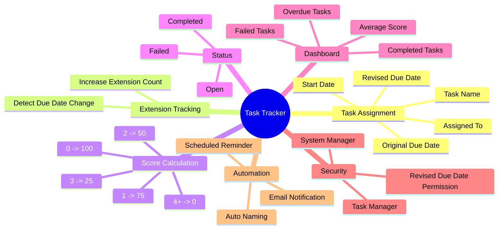
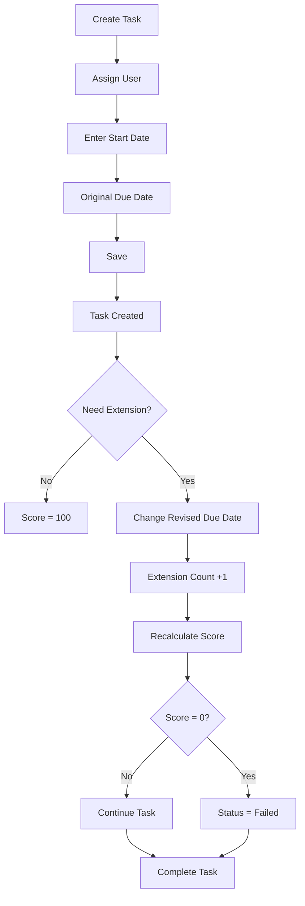
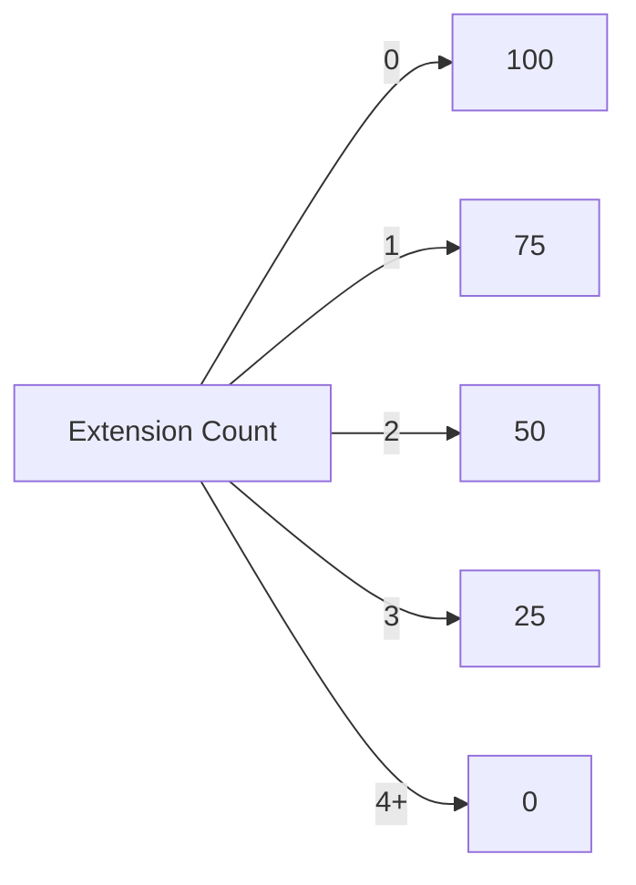
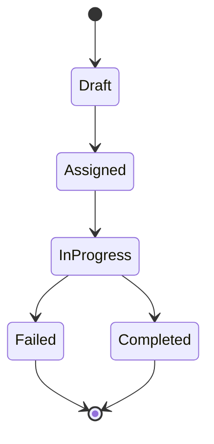
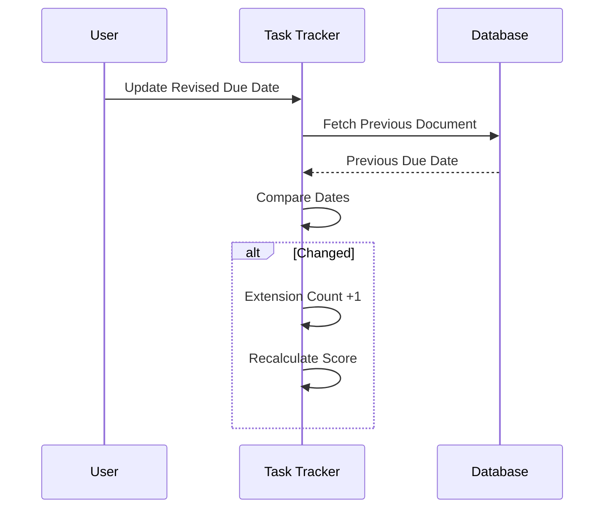
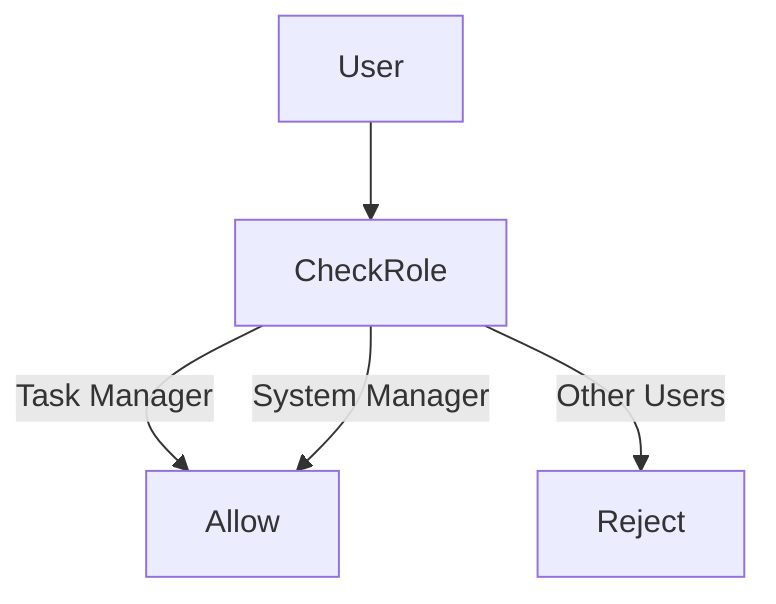

# PCJ

A custom ERPNext/Frappe application for FMCG solutions.

---

# Project 1 - Task Assignment & Score Tracker

A lightweight task delegation and performance scoring system built using the Frappe Framework.

The system automatically tracks deadline extensions and evaluates employee performance based on punctuality.

---

# Features

- Assign tasks to users
- Track Original & Revised Due Dates
- Automatic Extension Counter
- Automatic Score Calculation
- Auto Status Update
- Person-wise Performance Dashboard
- Failed Task Tracking
- Overdue Task Identification
- Permission Controlled Due Date Modification
- Auto-generated Task IDs

---

# Mind Map



---

# Workflow



---

# Score Calculation Logic



---

# Task Lifecycle



---

# Extension Tracking



---

# Permission Logic



---

# Dashboard Logic

```mermaid
flowchart LR

Task Tracker

--> Average Score

Task Tracker

--> Completed Count

Task Tracker

--> Failed Count

Task Tracker

--> Overdue Tasks
```

---

# Report Query Flow

```mermaid
flowchart TD

Task Tracker Table

--> SQL Query

SQL Query

--> Group By Assigned User

Group By Assigned User

--> Average Score

Group By Assigned User

--> Completed

Group By Assigned User

--> Failed

Group By Assigned User

--> Overdue
```

---

# Project Structure

```
pcj/

│

├── pcj/

│   ├── doctype/

│   │

│   └── task_tracker/

│       ├── task_tracker.py

│       ├── task_tracker.js

│       ├── task_tracker.json

│

├── report/

│   └── task_score_dashboard/

│       ├── task_score_dashboard.py

│       ├── task_score_dashboard.js

│       └── task_score_dashboard.json

│

├── utils.py

├── hooks.py

└── README.md
```

---

# Auto Naming

```
TT-Ram-2026-00001

TT-Ram-2026-00002

TT-John-2026-00001
```

---

# Business Rules

| Rule | Description |
|------|-------------|
| Extension Count | Increased only when Revised Due Date changes |
| Score | Calculated automatically |
| Original Due Date | Cannot be modified after creation |
| Revised Due Date | Editable only by authorized roles |
| Failed | Score = 0 |
| Overdue | Revised Due Date < Today & Status != Completed |
| Completed On | Must lie between Start Date and Due Date |

---

# Tech Stack

- Frappe Framework v15
- ERPNext
- Python
- JavaScript
- MariaDB
- Script Reports

---

# Future Enhancements

- Email escalation to managers
- Employee Leaderboard
- KPI Dashboard
- Charts using Dashboard Charts
- SLA Tracking
- Task Categories
- Priority Levels
- Notifications
- REST API Integration

---

# License

MIT